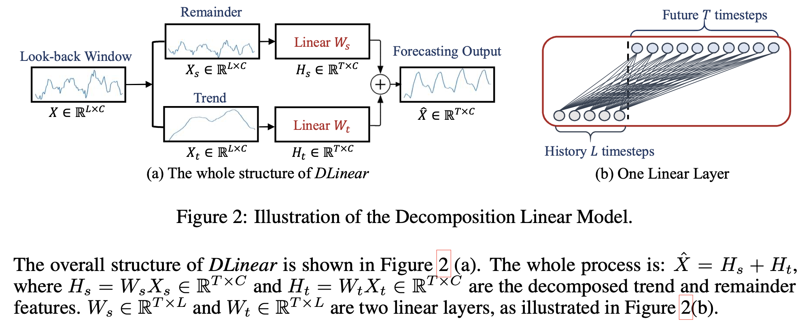

In a recent paper titled "[Are Transformers Effective for Time Series Forecasting?](https://arxiv.org/pdf/2205.13504.pdf)" published at AAAI 2023, the authors rigorously evaluated the effectiveness of various transformer-based algorithms for time-series forecasting. Their findings indicated that these algorithms are not ideal for forecasting over long sequences. To address this, the authors introduced a baseline neural network model called Decomposition Linear (DLinear), which employs linear layers. Their empirical results demonstrated that DLinear outperforms more complex transformer-based models in certain tasks.

However, one limitation of the original DLinear model is that it does not account for exogenous variables. In response to this, I propose a modification that enables the network to accept exogenous variables as inputs and integrate them into the model's weights. Specifically, a final linear layer is added to the network to facilitate the inclusion of these exogenous variables.

The original repo: https://github.com/cure-lab/LTSF-Linear

### DLinear

